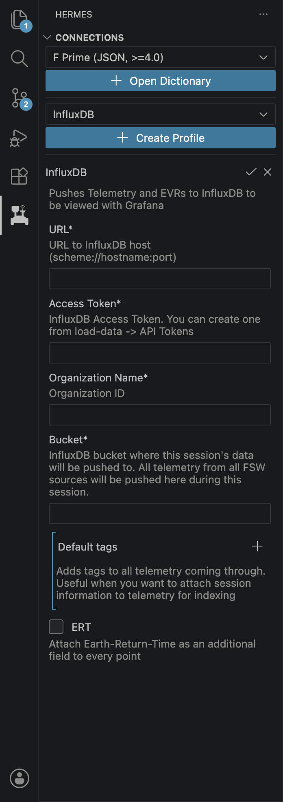

# InfluxDB

!!! info
    Please make sure you've read [Quick Start](../../getting-started/quick-start.md) first.

## Connecting to an InfluxDB Instance

{ width=200 align=right }

We will use the Hermes VS Code extension to connect the Hermes backend to an InfluxDB instance. First, make sure a backend is connected. In the Hermes tab, create an InfluxDB profile. Fill out all the information and click the checkmark and then the play button to connect. You should see telementry and events flowing to your InfluxDB instance.

!!! warning "Documentation In Progress"

    This documentation is incomplete while we are migrating from our internal documentation store to the public GitHub.
