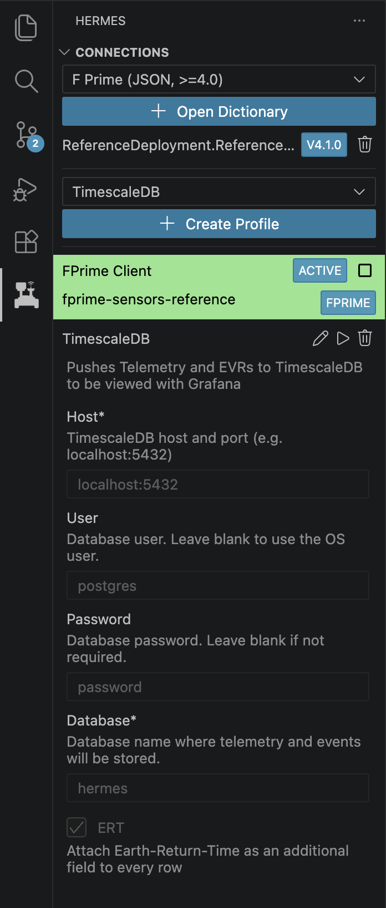
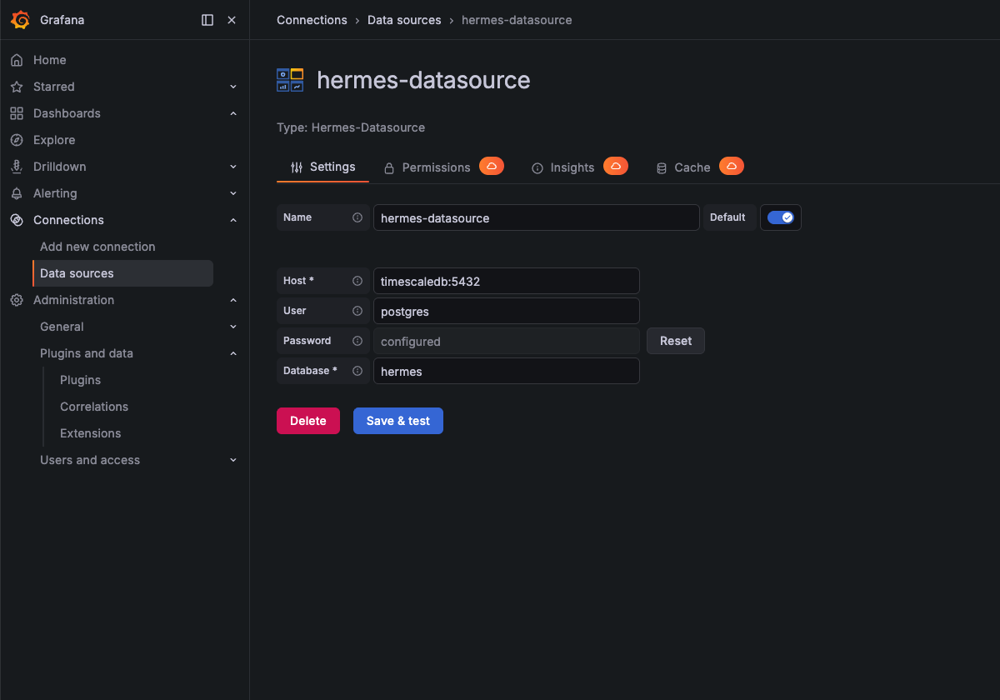
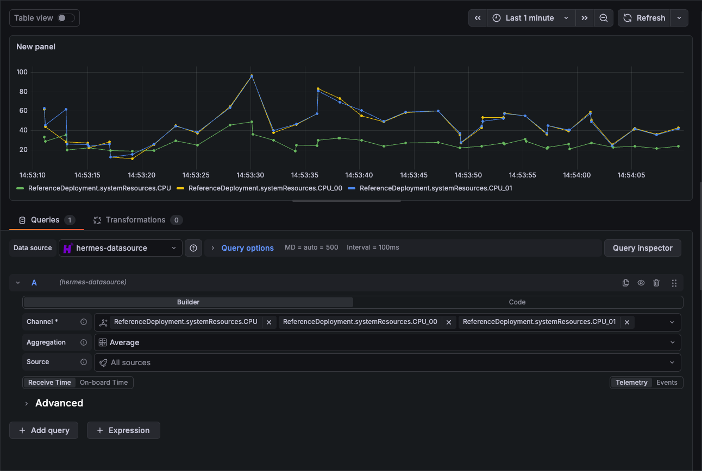

# TimescaleDB

## Using Grafana with TimescaleDB (Hermes Docker Compose)

Hermes offers a docker compose with TimescaleDB and Grafana, and a Grafana datasource plugin for use with TimescaleDB. The docker compose can be found at `docker-compose.yml`. To get started with development, start the database locally with `docker compose up -d`. Next, choose one out of these two options:

- Connect the backend to the database with a TimescaleDB profile from the Hermes VS Code extension (if you are using the Hermes backend).
- Push data to the database through some other means. The database is available at `localhost:5432`.

### TimescaleDB Profile (Hermes Backend Only)

{ width=200 align=right }

Hermes offers a TimescaleDB profile to connect your backend to a TimescaleDB database. Create a new TimescaleDB Profile and fill out the information. The default values can be found in the accompanying screenshot. Once you have both the flight software connection and the TimescaleDB connection, you should be able to see telemetry and events flowing into the database and should be visible in Grafana at `localhost:3000`.

### Grafana Plugin

Install the Hermes Grafana plugin by following the [Grafana plugin installation instructions](../grafana.md#installing-the-hermes-data-source-plugin). Then, configure the Hermes data source by navigating to the `Connections` dropdown and selecting `Data sources`. You should see a Hermes data source. If you do not see one, add a new data source. Next, fill out the connection information. The default config parameters are shown in the screenshot below, with password `password`. Once done, click `Save & test` to test the connection.



Once connected, we can visualize the data. Navigate to the `Dashboards` page and create a new dashboard. Add a panel and select `Configure visualization` on the panel. A query editor should pop up, as shown in the screenshot below. You can query your data using the form, starting with selecting the Hermes data source. The query will be automatically sent when you fill out a box. You can also use the refresh button on the top right to send the query.



## Custom TimescaleDB Instance (Not Using Hermes Docker Compose)

!!! note
    This step is not needed if connecting via the profile shown above.

Hermes also offers utilities to manually connect a local hermes backend to a TimescaleDB instance. In this example, we connect a local hermes backend to a local TimescaleDB instance. First, we start a local TimescaleDB instance via docker at `localhost:5432` with password `password`. Then, we can [start the Hermes backend in local mode](../../getting-started/quick-start.md#starting-the-hermes-backend) with `hermes.host.bind` set to:

```
"hermes.host.bind": {
    "bindType": "tcp"
}
```

Now, we can run the Hermes utility to connect the backend to the database. Compile and execute the code found in [`hermes/cmd/sqlrecord`](https://github.com/nasa/hermes/tree/main/cmd/sqlrecord) with the following command:

```
go run . --postgresql="postgres://postgre@localhost:5432/hermes_db?sslmode=disable"
```

!!! warning "Documentation In Progress"

    This documentation is incomplete while we are migrating from our internal documentation store to the public GitHub.
